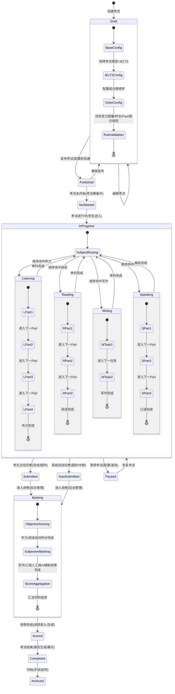

# 2026-4-16:唯寻考试平台v3.0

# 需求版本

| 版本 | 提出人 | 更新人 | JIRA | STORY |
| --- | --- | --- | --- | --- |
| V1.0 | candise、杨傅依PP | 卓文韬 | [BR-1583](http://jira-pub.visioneschool.com/browse/BR-1583) | [CPJLGZT-910](http://jira-pub.visioneschool.com/browse/CPJLGZT-910) |

# 需求背景&目标

> 说明项目要解决的是什么人，在什么场景下，碰到什么问题或要达成的目标，要拿出具体的依据和量化指标，说明是一个真实问题

| ## 背景 > 说明项目要解决的是什么人，在什么场景下，碰到什么问题，要解决什么问题 | 1.  **用户备考场景痛点**          1.  雅思已全面切换为机考模式，且考试规则与交互细节持续迭代（如写作字数统计、听力答题界面、口语考试流程更新），学生缺乏高度还原最新机考环境的模拟平台，无法精准适配真实考试的操作流程、时间节奏与交互体验。          2.  **业务开发效率痛点**          1.  唯寻杯每年固定开展 R1-R4 共 4 轮考试，每轮上线均需投入技术资源进行定制开发与测试，重复劳动成本高、迭代周期长。              2.  业务方无法自主调整考试配置，所有规则变更都依赖技术排期，影响考试运营的灵活性与响应速度。 |
| --- | --- |
| ## 目标 > 要达成的目标是什么，要尽量拿出具体的依据和量化指标，说明是一个真实问题 | 1.  **场景覆盖目标**          1.  同步雅思官方最新机考规则与交互细节，提供与真实考试 1:1 还原的线上模拟环境，覆盖听、说、读、写全流程，适配官方迭代的操作逻辑、界面布局与评分反馈机制。              2.  支撑雅思机考、牛剑笔试模考、语培类模考等多类型考试场景，确保模拟环境与官方考试体验高度一致，解决学生因不熟悉机考流程导致的发挥失常问题。          2.  **平台化效率目标**          1.  完成雅思机考平台的配置化改造，提供可视化运营配置页面，支持业务方自主完成雅思考试时间、报名规则、答题流程、防作弊策略、界面样式等配置，并可在线验证配置生效，无需依赖技术开发。          3.  **系统复用目标**          1.  实现一套底层架构支撑多类型考试（唯寻杯、step、牛剑模考、雅思等），避免重复开发，提升系统扩展性与维护性，为后续新增考试类型提供快速接入能力。 |

# 用户/业务旅程

> 清楚的描述谁在哪个场景步骤环节，目标、行为、痛点是什么，有什么机会点可以解决

| **场景步骤** | **考试配置** |
| --- | --- |
| **角色/节点** |  |
| **语培老师、产品经理** | 目标： *   雅思考试线上化      行为： *   创建雅思类型模考      痛点： *   雅思今年实行线上考试，学生须在真实场景下模拟考试 |
| **痛点&机会** | 能怎么解决 |

# 业务流程

> 以时序图、流程图或者文字形式描述业务实际流程；

# 需求规划

> 以脑图、excel表格形式呈现此次需求所覆盖的功能清单；

| **工作台范围** | **需求功能点** |
| --- | --- |
| 高端项目工作台 | 考试情况 |
| 产品经理工作台 | 增加考前、考中、考后配置项 |
| 唯寻考试平台 | 雅思考场适配 |
| 教学工作台 | 显示学生考试、答题情况、答题卡 |

[请至钉钉文档查看附件《考试平台适配雅思》。](https://alidocs.dingtalk.com/i/nodes/QOG9lyrgJP3mNyj2hzqQow1wVzN67Mw4?corpId=dingea7123e66b079d1e35c2f4657eb6378f&iframeQuery=anchorId%3DX02mo6lqko5hp3al6mh2nj&sideCollapsed=true&utm_scene=team_space)

# 原型示意图

原型地址：[https://modao.cc/proto/T95Ly6JMsrjwl674xeSHb/sharing?view\_mode=read\_only&screen=rbpVHUx9rNmqdKmcv](https://modao.cc/proto/T95Ly6JMsrjwl674xeSHb/sharing?view_mode=read_only&screen=rbpVHUx9rNmqdKmcv) #唯寻实考考试平台-分享

coding页面原型：[https://wentao475-droid.github.io/test\_center/](https://wentao475-droid.github.io/test_center/)

github地址：[https://github.com/wentao475-droid/test\_center](https://github.com/wentao475-droid/test_center)

# UI&UE设计稿

UI地址：

# 需求功能说明

> 清楚的描述没个功能模块、功能描述、各种条件判断、极限情况

| **功能模块** | **功能描述** | **页面截图** |
| --- | --- | --- |
| 高端项目工作台 需要先上，满足牛剑模考考试后内部员工查看成绩 | 1.  点击考试卡片后，进入列表          1.  增加答题情况按钮              2.  需要功能权限，名称：查看答题情况          2.  详情          1.  内容与学员考试记录详情相同              2.  组合卷展示                  1.  分不同的试卷进行评分展示                  3.  试卷名称              4.  答题正确率              5.  答题时长              6.  答题正确错误情况              7.  试卷详情                  1.  展示学生选项与正确选项 |   |
| 各工作台同步考试成绩信息详情页 需要先上，满足牛剑模考考试后内部员工查看成绩 | 1.  各平台考试数据增加详情页          1.  点击考试的卡片后，进入考试成绩列表页              2.  列表操作栏，增加答题情况按钮          2.  销售工作台          1.  客户管理                  1.  我的客户资源-学员详情                      2.  共享客户资源-学员详情                      3.  归档客户-学员详情                      4.  主管分配池-学员详情                  2.  TMK管理-学员详情              3.  订单管理                  1.  规划信息表                  4.  会员中心                  1.  新签大礼包              3.  留学工作台          1.  学员-学员详情          4.  市场工作台          1.  客户资源-学员详情          5.  班主任工作台          1.  学员-学员详情          6.  教学工作台          1.  学员-查看学员详情 |    |
| 教学工作台 | 1.  教学工作台          1.  教学考试成绩列表增加答题卡按钮                  1.  可跳转，答题卡页面                      2.  组合卷分试卷展示答题情况，同考试平台考试记录页面                          1.  客观题，自动批改后展示                 - **选择题**：根据正确选项批改。                 - **填空题**：存在多个正确答案时，与其中一个完全一致即算对。                 - **算分逻辑**：根据试卷（分数线）功能设置，映射对应科目的分数。                              2.  主观题，展示题目与考生作答内容                      2.  点击批改结果按钮                  1.  组合卷分试卷展示批改界面                      2.  每个试卷下方展示                          1.  试卷得分，根据考试类型，雅思考试可手动选择9.0-1.0，以0.5为一步所有分数，9.0、8.5、8.0、7.5、7.0、6.5、6.0、5.5、5.0、4.5、4.0、3.5、3.0、2.5、2.0、1.0、0.0                              2.  客观题，已自动批改的内容展示形式与答题卡相同                              3.  主观题，对应每道题（雅思考试每个part）展示输入框，保存、提交报告都非必填                              4.  模考得分，根据考试类型，雅思考试手动选择，9.0-0.0，以0.5为一步所有分数，9.0、8.5、8.0、7.5、7.0、6.5、6.0、5.5、5.0、4.5、4.0、3.5、3.0、2.5、2.0、1.0、0.0 |  |
| 产品经理工作台 | 1.  考前配置          1.  增加考前科目确认勾选                  1.  必填，单选选择，显示、不显示                      2.  显示，信息确认后，进入考试时展示组合卷考试科目                      3.  考前提示文案，富文本输入，选择显示考前科目后展示、必填，2000字上限 |  |
| 产品经理工作台 | 1.  考中配置          1.  显示配置时，增加题目显示                  1.  试卷整体显示                          1.  按题目顺序正常展示试卷                          2.  试卷分组显示（雅思）                          1.  根据试卷的分组，按part信息分别展示                      2.  工具箱                  1.  增加笔记，勾选后考试可使用笔记功能                  3.  听力题读题时间，非必填                  1.  题量 \* 【配置时间】，单位（秒），听力音频播放前，默认进入倒计时，倒计时结束后开始播放音频                      2.  题量，当前听力题下问题个数。如：听力题下5道题，配置时间5，则需等待25秒后，再播放听力音频                  4.  口语题作答时长上限                  1.  根据考试类型，若是雅思考试                      2.  录入Part 1、Part 2、Part 3，录音最长录音时间。单位：秒                  5.  口语题切换题目                  1.  禁止、允许                          1.  单选，默认勾选禁止 |  |
| 产品经理工作台 | 1.  防作弊配置          1.  操作功能，禁止输入非英文内容                  1.  考试中禁止输入法联想，待定，以前端实现 |  |
| 产品经理-关联试卷 | 1.  组合卷配置          1.  每个组合科目之间，增加时间配置              2.  可控制每个科目之间的休息时间                  1.  如：雅思口语考试前，可设置7200分钟（5天）              2.  未完成所有科目前，学生再次进入相同考场，都可继续进行考试     - **口语跨天续考机制**：口语考试允许跨天续考，遵循组合卷配置的科目间休息时间。     - 学生在休息时间内再次进入当前考场，会进入考前确认页，并弹出倒计时进入考试弹窗，点击后直接进入考场继续考口语。     - 若错过休息时间，当前考试直接强制交卷结束。 |  |
| 考试平台 | 1.  雅思考试          1.  无真题案例部分 |  |
| 考试平台 | 1.  考前科目确认页          1.  标题，取组合卷名称（IELTS Familiarisation Test）              2.  卡片科目标题，根据组合卷关联试卷的科目              3.  完成情况                  1.  未完成时，显示Not completed                      2.  已完成时，显示Completed                  4.  考试时间，根据组合卷配置的时间展示              5.  提示语，请确认您的考试环境安静，网络稳定，相关设备工作正常。点击下方按钮即可进入对应部分的考试。              6.  考前提示，根据配置提示文案进行展示              7.  进入考试按钮，Start+【科目名称】 |   |
| 考试平台 | 1.  听力          1.  此页面有UI              2.  进入听力考试              3.  若配置了读题时间，进入听力part1-4时，先进入倒计时                  1.  此时不允许编辑答题                      2.  此时可切换到其他part，倒计时仅根据当前part。如：part1有30秒倒计时，考生进入后切换到别的part，还是在这30秒上进行倒计时                  4.  音频播放完毕，自动播放下一个part的音频，同样若配置了读题时间，再进入这个part的倒计时          2.  答题&题号          1.  每个part展示全部的题目，选中题目后，对应题号高亮展示              2.  已回答的题目，题号展示样式          3.  高亮&备注          1.  鼠标划词后，展示悬浮气泡              2.  可选择高亮（Highlight）或备注（Add Note）                  1.  高亮点击后，仅高亮划词部分，黄色高亮                          1.  再次点击黄色高亮部分后，取消高亮                          2.  备注点击后跳出弹窗                      3.  输入需要备注的内容。备注字数上限200词，点击Save保存                      4.  备注后，备注划词区增加下划线和蓝色高亮                      5.  点击蓝色划词区展示备注弹窗                      6.  高亮&备注仅在考试中查看，无需存储                  3.  提交试卷时，校验当前作答完整性，弹窗提示                  1.  确认提交，直接提交当前试卷答案                  4.  确认后，返回到考前确认页，并且弹出 |  |
| 考试平台 | 1. 阅读   1. 此页面有UI，模拟雅思官方样式   2. 答题方式与听力相同   3. 高亮   1. 选中划词后，展示气泡（Hightling）、添加笔记（Add Note）   4. 段落标记   1. 阅读每个段落前，有标记按钮   2. 点击后，弹出输入弹窗   5. 工具箱   1. 点击Note，弹出笔记弹窗   2. 笔记中，展示笔记内容。   3. 段落中划线的内容，仅展示一行，多出部分收起，点击展开可查看全部划线内容  - **持久化说明**：高亮与备注规则同听力，仅当前会话有效，刷新保留，退出重进清空，无需后端持久化。  2. 提交试卷提示弹窗  3. 提交试卷后，返回考前确认页并弹出下一门科目弹窗，显示阅读已完成 |  |
| 考试平台 | 1.  写作          1.  此页面有UI              2.  支持解答题题型              3.  答题区文本输入              4.  有字数统计，需要存储，考试结果页面展示此数据              5.  下方展示二维码上传方式              6.  提交试卷后，展示提示          2.  提交后，返回考前确认页 |   |
| 考试平台 | 1.  口语          1.  part1                  1.  进入后根据口语题目，考官开始念题目，将题目内容转为音频                      2.  考官播放问题时，考生麦克风按钮置灰                      3.  考官问题播放结束后，考生点击麦克风开始录音回答                      4.  单题录音最长时长，45秒，根据考中配置                          1.  录音在还剩10秒时，出现倒计时红色展示，到45秒后直接保存录音                          5.  最少录音时长，5秒，5秒前不允许考生切断录音                      6.  录音结束后，考官立即播放下一道题                      7.  所有题目录制完成后自动进入part2                  2.  part2                  1.  part2开始时，自动播放考官读题音频                      2.  读题后，立即进入准备倒计时，倒计时1分钟                          1.  还剩10秒时，红色展示                              2.  准备时，自动打开Note笔记                              3.  草稿内可编辑输入，仅在当前页面展示，其他part无需保存笔记内容                          3.  准备完成后，录音自动开始                          1.  笔记弹窗不用关闭                              2.  还剩10秒时，红色展示                      3.  part3                  1.  考试形式与part1相同                      2.  考官读题，考生点击录制开始作答              2.  口语考试完成后，正常考试结束，进入考试记录页面 |    |
| 考试平台 | 1.  写作（解答题）考试记录展示          1.  分数，后台上传后展示              2.  总词数，根据写作次数统计展示，part1/part2              3.  用时，整场写作用时              4.  展示题目              5.  展示写作内容          2.  口语（口语题）考试记录展示          1.  分时，后台上传后展示              2.  用时，单科目考试时长              3.  展示题目文本              4.  展示学生作答音频                  1.  支持播放、暂停、拖动                      2.  点击更多可下载                      3.  展示音频转文本内容 |   |
| 产品经理工作台 高端工作台 | 1.  考试情况列表          1.  增加批量下载答题卡功能              2.  增加按钮，下载答题卡              3.  每行最前方增加选择框              4.  打包当前学生当场考试下全部客观题答题内容                  1.  雅思                          1.  口语音频分题目，音频名称，第X题-考生-准考证号                              2.  写作分题目导出pdf，pdf名称，第X题-考生-准考证号                              3.  打包在一个文件夹后压缩，压缩包名称，考生-科目-准考证号                          2.  step                          1.  全部图片打包在一个压缩文件（已有功能）                      5.  选择后，点击下载答题卡，按每个学生的答题卡转到下载中心进行下载              6.  下载中心支持答题卡批量下载          2.  产品经理工作台，增加下载中心 |  |
| 教研工作台 业务方 | 1.  录入试卷适配考试平台          1.  雅思试卷，需按听力、阅读、写作、口语四个科目分卷子录入              2.  听力                  1.  单个考试试卷中，录入4个part的部分，录入完成后，再通过关联分组区分每个part对应的题目                  3.  阅读                  1.  单个考试试卷中，录入3个part的部分，录入完成后，再通过关联分组区分每个part对应的题目                  4.  写作                  1.  单个考试试卷中，录入2个part的部分，录入完成后，再通过关联分组区分每个part对应的题目。小作文part1，大作文part2                  5.  口语                  1.  单个考试试卷中，录入3个part的部分，录入完成后，再通过关联分组区分每个part对应的题目。              2.  雅思配置          1.  语音检测不勾选 |  |

# 数据埋点

> 埋点需求必须要清晰的告诉研发：  
1、清晰的告诉研发要在哪个应用上埋点；  
2、清晰的告诉研发要在哪个功能、页面上埋点；

> 3、清晰的告诉研发在什么条件下触发埋点；

> 4、清晰的告诉研发要采集什么数据；

> 5、清晰的告诉研发采集数据时的限制条件；

> 6、是否提供功能截图用于辅助理解。涉及埋点需求可参考以下附件。[埋点需求设计规范20231024-V1.docx](http://confluence.visioneschool.com/pages/viewpage.action?pageId=48729565#)

| **场景** | **埋点类型名称** | **事件Event\_ID** | **事件显示名** | **属性变量名** | **事件属性显示名** | **属性值类型** | **属性值示例** | **触发条件** | **备注** | **截图** |
| --- | --- | --- | --- | --- | --- | --- | --- | --- | --- | --- |
|  |  |  |  |  |  |  |  |  |  |  |
|  |  |  |  |  |  |  |  |  |  |  |

# 风险&防范措施（超大项目必填\*）

| ## 市场风险&防范措施 > 是不是用户的痛点   是否能达成运营目标 |  |
| --- | --- |
| ## 技术风险&防范措施 > 技术是否可以实现   ROI是否合理，（评估开发周期、第三方费用等技术成本）   时间是否来得及 |  |

# 沟通纪要

> 记录每次沟通方案的结论和todo

| 沟通时间 | 纪要 | todo进展 |
| --- | --- | --- |
|  |  |  |
|  |  |  |

# 评审纪要

| 评审时间 | 评审结论 | todo进展 |
| --- | --- | --- |
|  |  |  |
|  |  |  |